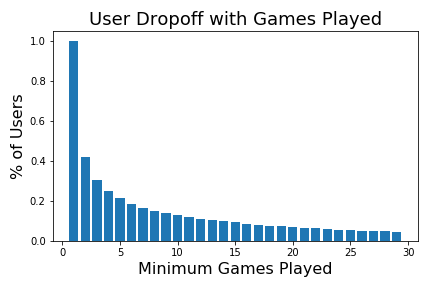
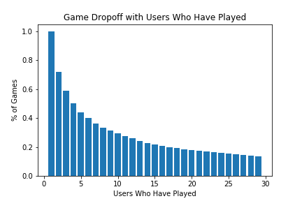
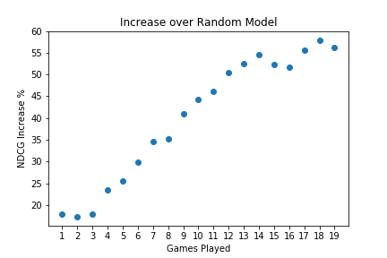

## Playtime Distribution (playtime_distribution.ipynb)
[Check the jupyter notebook for EDA](notebooks/playtime_distribution.ipynb)  

We can see that the number of Users who have played n or more Games drops off very quickly.  

The number of Games with n or more Users drops off less quickly:  

## Train / Test split
The standard train test split does not necessarily work for recommender systems.  
The method used here for creating splits is to split only by users, feeding
some percentage of the test users' data back into the training set.

## Evaluation Metrics
RMSE is somewhat useful but misleading.  
It is only going to tell us how close our rating predictions are to the held-out Users actual ratings.  It will not tell us anything about how well we are ranking the games we recommend.  

Instead of using RMSE, we will use NDCG to evaluate the utility provided by our top-N recommendations compared to the best possible utility that could be provided with the optimal ordering of held-out games.  
NDCG on a single item ranges from 0 (worst) to 1 (best)  

NDCG by itself will be potentially misleading, however.  In the case of only keeping 1 game in our system, we will have the best possible NDCG because recommending that game will always have the same DCG as the optimal ordering.  There is no way to make a bad recommendation.  

So the final evaluation metric that we will use is NDCG for our model predictions compared to the NDCG of a random prediction.  We will see how much our model outperforms random predictions as a percentage increase.  

For example, the NDCG % Increase for a model only training on Users with n+ games played:  

## Optimal Users and Games to include in the model
There is a tradeoff when restricting the model to only include Users with a certain number of Games played.  Our metrics will improve, but our model will be usable for a lower and lower percentage of our user base.

The final model chosen was trained on Users with 5+ games played
and Games with 3+ Users.  
Recommending 5 Games:  

Final Model NDCG Increase Over Random: 30.15%  
Final Model Validation NDCG Increase Over Random: 34.19%  
Random RMSE Increase Vs Model: 222.55%  

For some potential next steps, [click here](./next_steps.md)
